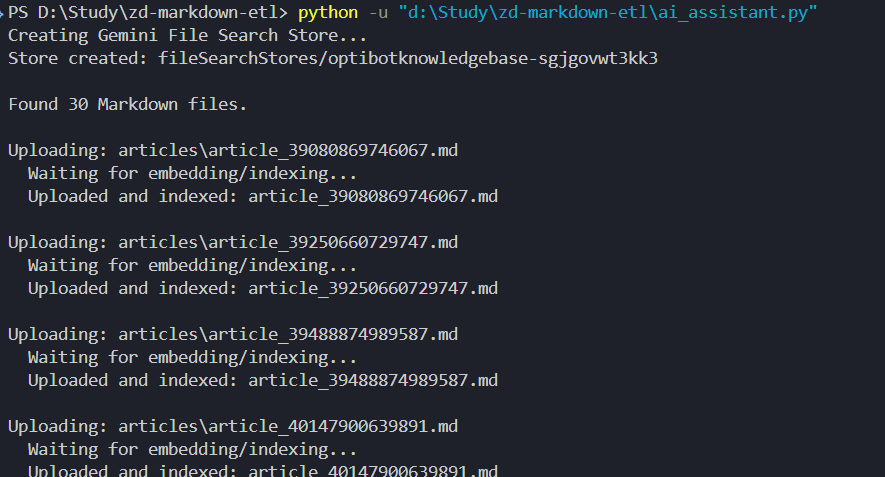
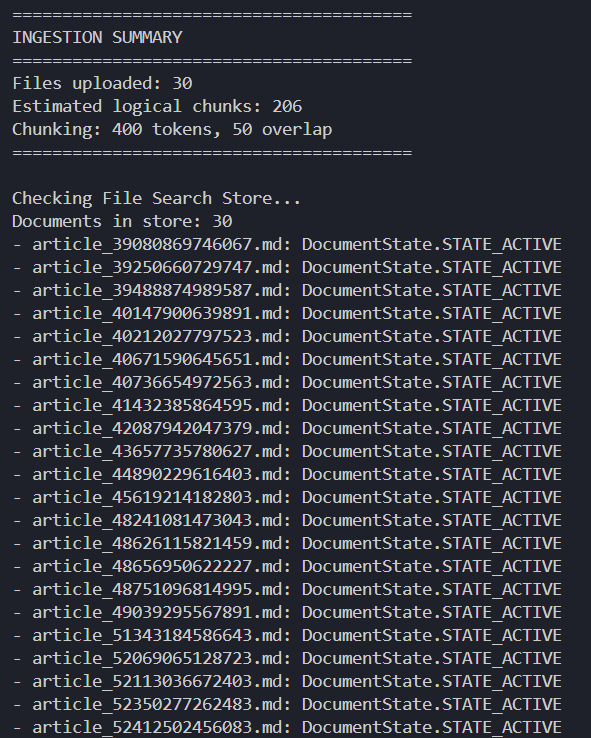
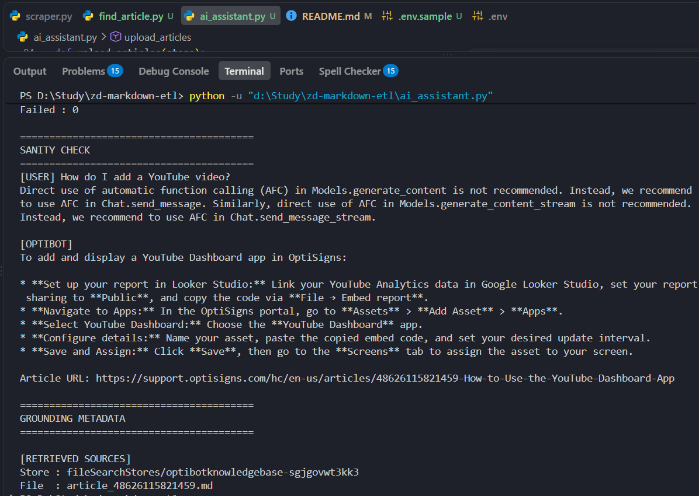
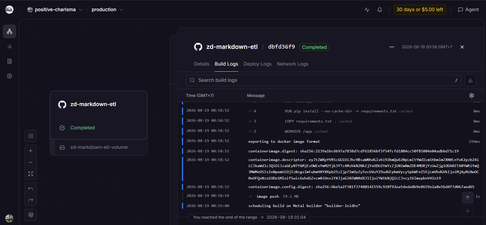
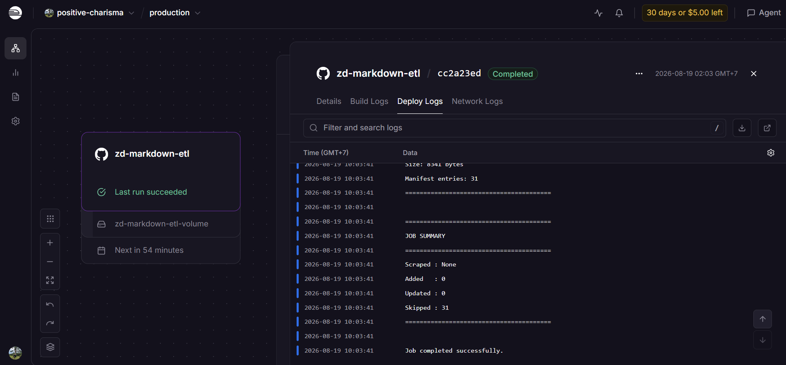
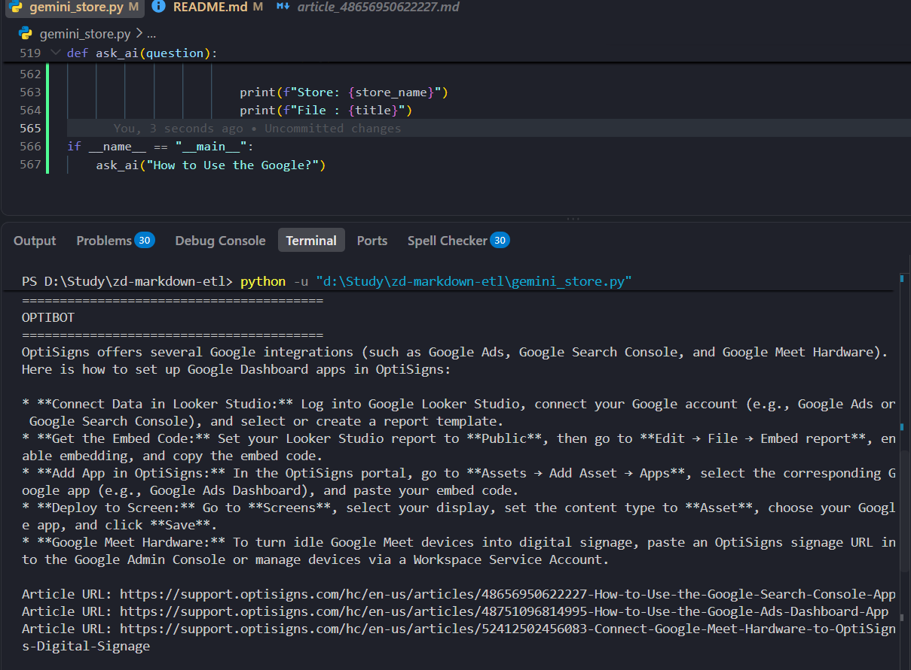

# OptiBot Mini-Clone — Zendesk → Gemini File Search ETL

> A implementation of the OptiBot take-home test: scrape OptiSigns Help Center articles, normalize them to Markdown, ingest them into a persistent Gemini File Search Store, and run a daily delta-sync job on Railway.

## 1. Overview

— The pipeline scrapes 30 OptiSigns Help Center articles through the Zendesk API, converts HTML to clean Markdown, preserves an `Article URL:` source line, uploads documents programmatically to a single Gemini File Search Store, and synchronizes only new/updated content on scheduled runs.



## 2. Architecture

```text
Zendesk API
   ↓
Scraper (30 articles)
   ↓
HTML → Markdown
   ↓
SHA-256 change detection
   ↓
Persistent manifest (/app/state/manifest.json)
   ↓
Gemini File Search Store
   ├─ ADDED    → upload
   ├─ UPDATED  → delete old document + upload new version
   └─ SKIPPED  → no upload
   ↓
Gemini File Search retrieval
   ↓
OptiBot answer + Article URL citation

Railway Cron
   ↓
main.py
   ↓
run once → sync → log → exit 0
```

## 3. AI Assistant

**System prompt (required by the test):**

```text
You are OptiBot, the customer-support bot for OptiSigns.com.
• Tone: helpful, factual, concise.
• Only answer using the uploaded docs.
• Max 5 bullet points; else link to the doc.
• Cite up to 3 "Article URL:" lines per reply.
```

The assistant is configured/tested in Google AI Studio, while document ingestion is performed programmatically through the Gemini API (no UI drag-and-drop).

## 4. Vector Store / Knowledge Base

**EN** — Uses one persistent Gemini File Search Store. The store is created once and its resource name is stored in `GEMINI_FILE_SEARCH_STORE_NAME`. Files are uploaded with the Gemini File Search API and indexed for retrieval.

**Chunking strategy**

- Maximum chunk size: **400 tokens**
- Overlap: **50 tokens**
- Gemini performs the actual chunking, embedding, and indexing.
- The ingestion job logs an estimated logical chunk count for reporting.



## 5. Delta Sync

**EN** — Each scraped Markdown file is hashed with SHA-256 and compared with `state/manifest.json`.

| Change    | Action                                                                                           |
| --------- | ------------------------------------------------------------------------------------------------ |
| Unchanged | `SKIPPED` — no upload                                                                            |
| New       | `ADDED` — upload to the existing store                                                           |
| Changed   | `UPDATED` — delete the previous Gemini document, upload the new version, and update the manifest |

The manifest stores the local filename, content hash, and Gemini document resource name.

## 6. Railway Deployment

**EN** — The job is containerized and runs `python main.py` once per execution. Railway mounts a persistent Volume at `/app/state` so the manifest survives between executions.

**Environment variables :**

```text
GEMINI_API_KEY=<your Gemini API key>
GEMINI_FILE_SEARCH_STORE_NAME=fileSearchStores/<your-store-id>
```

**Cron:** daily schedule on Railway. The current test schedule was temporarily set to every 5 minutes; final submission should use once per day.

## 7. Local Run

```powershell
python main.py
```

Expected unchanged-run output:

```text
Added   : 0
Updated : 0
Skipped : 30
```

After changing one source article:

```text
Added   : 0
Updated : 1
Skipped : 29
```

After adding one new article:

```text
Added   : 1
Updated : 0
Skipped : 30
```

The File Search Store should remain a single persistent store; an update replaces the old document instead of creating a duplicate.

## 8. Docker / Docker

```powershell
docker build -t optibot-etl .
docker run --rm `
  -e GEMINI_API_KEY="$env:GEMINI_API_KEY" `
  -e GEMINI_FILE_SEARCH_STORE_NAME="$env:GEMINI_FILE_SEARCH_STORE_NAME" `
  optibot-etl
```

The container runs `main.py`, completes the ETL job, logs the result, and exits with code `0` on success.

## 9. Sample Question

```text
How do I add a YouTube video?
```

The assistant should answer only from the uploaded OptiSigns documentation and include an `Article URL:` citation.

**Assistant screenshot / Ảnh chụp assistant:**



**Daily job logs / Log daily job:**




## 10. Project Files

```text
main.py            # ETL orchestration
scraper.py         # Zendesk scraping + HTML → Markdown
gemini_store.py    # File Search Store + delta sync
articles/          # Scraped Markdown corpus
state/manifest.json# Persistent sync state
Dockerfile         # Container image
.env.sample        # Required environment variables
```

### Data Scope and Production Difference

**EN**

The current take-home implementation intentionally ingests 30 OptiSigns articles using the Zendesk Help Center API. The API response is paginated, so the current scraper only processes the first page of results. As a result, the local/production knowledge base does not yet contain the full OptiSigns documentation corpus.

Because the retrieved dataset is smaller than the actual production OptiBot knowledge base, the answer from this implementation may differ from the answer returned by the real OptiSigns production system. This is expected and does not indicate a retrieval or generation failure.

For the take-home scope, the scraper meets the requirement of ingesting at least 30 articles. In a production implementation, the scraper should follow Zendesk pagination to ingest the complete article set, and the daily job should detect and synchronize new or updated articles into the same Gemini File Search Store.


